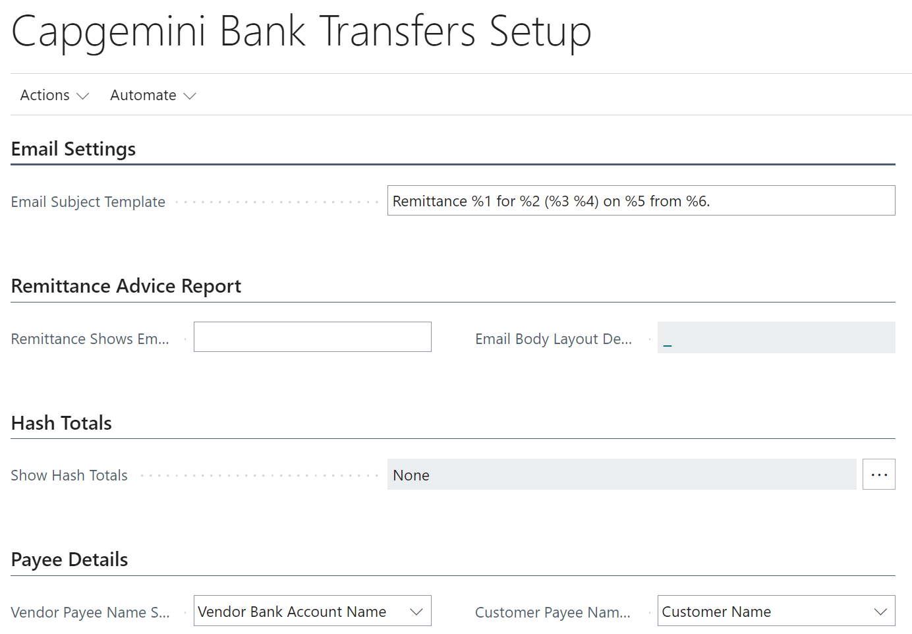

The Bank Transfers app has been designed so it can be used with a minimum amount of setup. There are a couple of things that need to be in place before you can start to work through the usage scenarios.

## Permissions

The Intergen Bank Transfers app permission sets can be seen by going to the *Permission Sets* page and searching for Bank Transfers.

There is only one permission set for the Bank Transfers app, so assign this permission set to any users that need to work with the app.

## Capgemini Bank Transfers Setup

If you want to send remittances as an email attachment directly to your payees, you must configure the *Email Settings* on the *Capgemini**Bank Transfers Setup* page.

Here you can set the *Email Subject* you want to show on the emails you send. This is specified using a template to set the subject of a remittance advice email.

You can use the following placeholders: %1=Transaction No., %2=Payee Name, %3=Account Type, %4=Account No., %5=Payment Date, %6=Company Name.

If you want a different email address to be shown in the remittance advice report layout than the one you are emailing the remittance advices from, complete the *Remittance Shows Email Address* field. If left blank, the Company Information E-Mail field will be used.

The Remittance Advice Report (70315075) has a Word layout which you can modify using Custom Report selections.  You can also define an *Email Body Layout Definition* to be used when you email your remittance advices.

*Show Hash Totals* allows you to select whether you want hash totals to show on the Payment Breakdown report.  The choices are None, New Zealand or Westpac New Zealand

In the *Payee Details* section you can specify if you want the Vendor Name or Vendor Bank account Name to appear in the generated bank file.  The same option is availalble for customers (for EFT refunds)

!!! info
    The ABN and GLN (NZBN) fields have been included in the report dataset for the Remittance Advice Report.

## Pay-from Bank Accounts

Before you can post to a Bank Account, you must configure *Bank Acc. Posting Group*. You can find details on how to set up bank accounts in the standard online help for Business Central.

To use a bank account as a pay-from bank account for EFT payments, you must have a *Bank Branch No.* and *Bank Account No.* configured with values that indicate which file format is to be used. If you have an Australian bank account in a New Zealand company, you must specify the AUD currency code against the bank account as well as have a correctly formatted bank account. If you are using a New Zealand bank account in a New Zealand company, the currency code must be left blank (to indicate it is using the local currency). Similarly in an Australian company an Australian bank will have a blank currency and a New Zealand bank account will have an NZD currency code.

### Australian Bank

For an Australian banks account to be available for producing an Australian Banking Association (ABA) File Format export, it must have the following fields configured:

| Bank Account Field | Description |
| --- | --- |
| **Bank Branch No.** | Must match format AAB-CCC Where A = 2 digit bank code B = 1 digit state code C = 3 digit branch location code |
| **Bank Account No.** | Must match format DDDDDDDDD Where D = up to 9 digit bank account |
| **AU EFT Bank Code** | The three-character mnemonic code for the bank e.g. ANZ, WPA |
| **AU EFT Security Name** | Your account name |
| **AU EFT Security No.** | You user identification number |

  
  

### New Zealand Bank

To use a New Zealand bank to produce EFT files, it must have the following fields configured:

| Bank Account Field | Description |
| --- | --- |
| **Bank Branch No.** | Must match format AA-BBBB Where A = 2 digit bank code (see list below) B = 4 digit branch code **Supported Bank Codes** ANZ - 01, 06, 11 ASB - 12 BNZ - 02 Kiwibank - 38 Westpac - 03 |
| **Bank Account No.** | Must match format CCCCCCC-DD or CCCCCCC-DDD Where CCCCCCC = 7 digit bank account number DD or DDD = 2 or 3 digit suffix |

## Vendor

You can pay your vendors in an EFT file without any configuration, but if you want to send a remittance advice through email and you want to use an email address that is different to the vendor's regular *Email* field, you can configure the *Email for Remittance Advice* field.

| Vendor Field | Description |
| --- | --- |
| **Email for Remittance Advice** | Email address that remittance advice should be emailed to.  **Note:** If this field is left blank, the *Email* field will be used. |
| **Our Account No.** | Our account number with the vendor. This field can be used as the source for the various reference fields in an EFT file (such as Reference, Code, or Particulars) |

## Vendor Bank Accounts

Vendor bank accounts should conform to the same country specific formats as defined for bank accounts.

### Australian Bank

Vendor bank accounts being paid via Australian Bank Association (ABA) file format must have the following fields configured:

| Bank Account Field | Description |
| --- | --- |
| **Bank Branch No.** | Must match format AAB-CCC where:  A = 2 digit bank code B = 1 digit state code C = 3 digit branch location code |
| **Bank Account No.** | Must match format DDDDDDDDD where:  D = up to 9 digit bank account |

### New Zealand Bank

Vendor bank accounts being paid via any of the supported NZ file formats must have the following fields configured:

| Bank Account Field | Description |
| --- | --- |
| **Bank Branch No.** | Must match format AA-BBBB where:  AA = A two-digit bank code. BBBB = A four-digit branch number. |
| **Bank Account No.** | Must match format CCCCCCC-DD or AA-BBBB-CCCCCCC-DDD where:  CCCCCCC = A seven-digit account number. DD or DDD = A two- or three-digit suffix. |

### References

Vendor specific references can be setup using rules from the Vendor Bank Account card.

For NZ these can be set for Our Particulars, Code and Reference fields and for the Vendor (Theirs).  
For Australia these can be set for the Lodgement Reference and the Name of the Remitter.

For each Reference use the ... to select the Rule to apply.

Any rules setup against the Vendor will replace the rules you set at the time of creating the payment file.

## One-time Vendors

The one-time vendor feature allows payment details such as name, address, bank account, remittance email, and our account number or reference to be specified at the time the order or purchase invoice is entered. To use the one-time vendor feature, you must first configure a vendor to be marked as a one-time vendor.

### Vendor Card

Set the One-time Vendor field on the vendor card to true.

## Customer

You can pay your customers in an EFT file (when you need to process a refund payment) without any configuration, but if you want to send a remittance advice through email and you want to use an email address that is different to the customer's regular *Email* field, you can configure the *Email for Remittance Advice* field. You can also use the *Our Account Number* field as the source for the various reference fields in an EFT file (such as Reference, Code, or Particulars).

| Customer Field | Description |
| --- | --- |
| Email for Remittance Advice | Email address that remittance advice should be emailed to.  **Note:** If this field is left blank, the *Email* field will be used. |
| Our Account No. | Our account number with the customer. |

## Customer Bank Accounts

Customer bank accounts should conform to the same country specific formats as defined for bank accounts.

### Australian Bank

Customer bank accounts being paid via Australian Bank Association (ABA) file format must have the following fields configured:

| Bank Account Field | Description |
| --- | --- |
| **Bank Branch No.** | Must match format AAB-CCC where:  A = 2 digit bank code B = 1 digit state code C = 3 digit branch location code |
| **Bank Account No.** | Must match format DDDDDDDDD where:  D = up to 9 digit bank account |

### New Zealand Bank

Customer bank accounts being paid via any of the supported NZ file formats must have the following fields configured:

| Bank Account Field | Description |
| --- | --- |
| **Bank Branch No.** | Must match format AA-BBBB where:  AA = A two-digit bank code. BBBB = A four-digit branch number. |
| **Bank Account No.** | Must match format CCCCCCC-DD or AA-BBBB-CCCCCCC-DDD where:  CCCCCCC = A seven-digit account number. DD or DDD = A two- or three-digit suffix. |

References can also be setup for Customers by selecting the References option from the ribbon of the Customer Bank Account page.